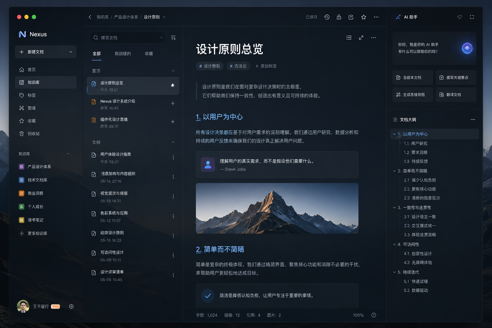

# 墨核 Mohe

一个本地优先的 AI 驱动 Markdown 知识库桌面应用。


## 功能特性

- **AI 对话** - 支持 OpenAI / Ollama 等兼容 API，流式响应
- **RAG 知识库** - 文档分块、向量嵌入、语义检索，让 AI 基于你的文档回答
- **Agent 工具调用** - AI 可自动调用工具（搜索文档、提取大纲、翻译等）
- **Markdown 编辑器** - 分屏预览，支持 KaTeX 公式和 Mermaid 图表
- **长期记忆** - 陈述性/程序性记忆，自动衰减，语义搜索
- **数据管理** - JSON 导出/导入备份，数据完全本地存储

## 技术栈

| 层级 | 技术 |
|------|------|
| 前端 | React 18 + TypeScript + Vite 6 |
| 桌面 | Tauri 2 + Rust |
| 编辑器 | CodeMirror 6 |
| 状态管理 | Zustand |
| 样式 | Tailwind CSS |
| 数据库 | SQLite |
| AI | OpenAI 兼容 API / Ollama |

## 快速开始

### 环境要求

- [Node.js](https://nodejs.org/) >= 18
- [Rust](https://www.rust-lang.org/) >= 1.70
- Windows / macOS / Linux

### 安装依赖

```bash
npm install
```

### 开发模式

```bash
npx tauri dev
```

### 构建生产版本

```bash
npm run build
npx tauri build
```

## 项目结构

```
Mohe/
├── src/                    # 前端源码
│   ├── components/         # React 组件
│   ├── services/           # 业务逻辑服务
│   ├── stores/             # Zustand 状态管理
│   ├── types/              # TypeScript 类型定义
│   └── App.tsx             # 应用入口
├── src-tauri/              # Tauri / Rust 后端
│   ├── src/                # Rust 源码
│   ├── capabilities/       # 权限配置
│   ── tauri.conf.json     # Tauri 配置
└── images/                 # 设计资源
```

## 配置 AI 模型

首次启动后，点击左侧栏底部的 **设置** 按钮：

1. 选择 AI 提供商（Ollama / OpenAI 兼容）
2. 填写 Base URL 和 API Key
3. 设置对话模型和向量嵌入模型
4. 点击 **测试连接** 验证配置

### Ollama 示例

| 配置项 | 值 |
|--------|-----|
| Provider | Ollama |
| Base URL | `http://localhost:11434` |
| Model | `qwen2.5:latest` |
| Embedding Model | `nomic-embed-text` |

## 截图



## 许可证

[MIT](LICENSE)
